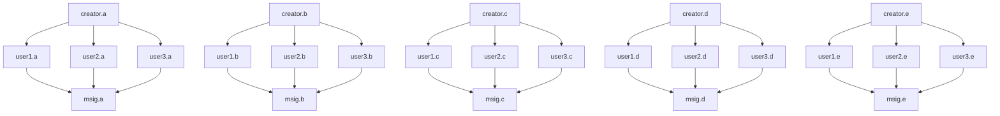

# `@substreams/node`

> Substreams for `Node.js`

## Install

```sh
npm install @substreams/node
```

**⚠️Warning:** This package is native [ESM](https://developer.mozilla.org/en-US/docs/Web/JavaScript/Guide/Modules). If your project uses CommonJS, you'll have to [convert to ESM](https://gist.github.com/sindresorhus/a39789f98801d908bbc7ff3ecc99d99c) or use the [dynamic `import()`](https://v8.dev/features/dynamic-import) function. Please don't open issues for questions regarding CommonJS / ESM.

## Usage

```js
import { createDefaultTransport } from "@substreams/node";
import {
  createRegistry,
  createRequest,
  fetchSubstream,
  isEmptyMessage,
  streamBlocks,
  unpackMapOutput,
} from "@substreams/core";

// auth API token
// https://app.streamingfast.io/
if (!process.env.SUBSTREAMS_API_TOKEN) {
  throw new Error("SUBSTREAMS_API_TOKEN is require");
}
const token = process.env.SUBSTREAMS_API_TOKEN;
const baseUrl = "https://mainnet.eth.streamingfast.io:443";

// User parameters
const url =
  "https://github.com/pinax-network/subtivity-substreams/releases/download/v0.2.1/subtivity-ethereum-v0.2.1.spkg";
const outputModule = "prom_out";
const startBlockNum = 12292922n;
const stopBlockNum = "+3";

// Download Substream
(async () => {
  const substreamPackage = await fetchSubstream(url);

  // Connect Transport
  const registry = createRegistry(substreamPackage);
  const transport = createDefaultTransport(baseUrl, token, registry);
  const request = createRequest({
    substreamPackage,
    outputModule,
    productionMode: true,
    startBlockNum,
    stopBlockNum,
  });

  // Stream Blocks
  for await (const response of streamBlocks(transport, request)) {
    const output = unpackMapOutput(response.response, registry);
    if (output && !isEmptyMessage(output)) {
      console.dir(output.toJson({ typeRegistry: registry }));
    }
  }
})();
```